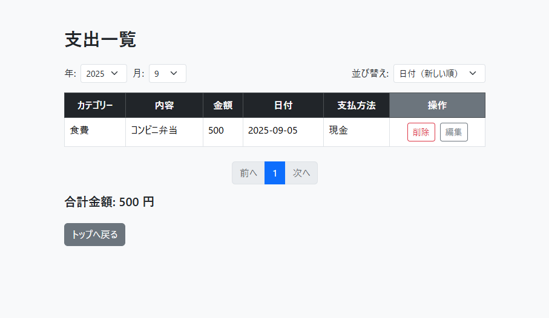

# 小遣い管理アプリ

## 概要
このアプリは、日々の支出を記録・管理するための簡易的なWebアプリケーションです。  
Spring Bootを使用し、Webフォームから支出を登録し、MySQLに保存されたデータを一覧表示・編集・削除する機能を実装しています。  

※現在は支出管理機能のみを実装済。収入管理機能は今後追加の予定。

---

## 使用技術

- Java
- Spring Boot
- MySQL
- Spring MVC
- Thymeleaf
- HTML / Bootstrap
- Git / GitHub

---

## 実装済みの主な機能

- トップ画面

  

- 支出の新規登録（フォーム入力 → DB登録）
  
  

  

  ※未入力チェックあり
  
  

- 支出一覧の表示（DB → Web画面）

  

- 支出の編集・削除機能（一覧画面から操作可能）

  ・削除

  

  

  ・編集
  
  

  

---

## セットアップ方法

以下の手順でローカル環境にて実行可能です。

```bash
# 1. プロジェクトのクローン
git clone https://github.com/ReoTokeshi/kodukaiPJ.git
cd kodukaiPJ

# 2. MySQLで以下のデータベースを作成
CREATE DATABASE kodukai_db CHARACTER SET utf8mb4;

# 3. ファイル名を変更「application_dummy.properties」⇒「application.properties」し、DB接続情報を設定
spring.datasource.username="your-username"
spring.datasource.password="your-password"

# 4. アプリケーションの起動
./gradlew bootRun
